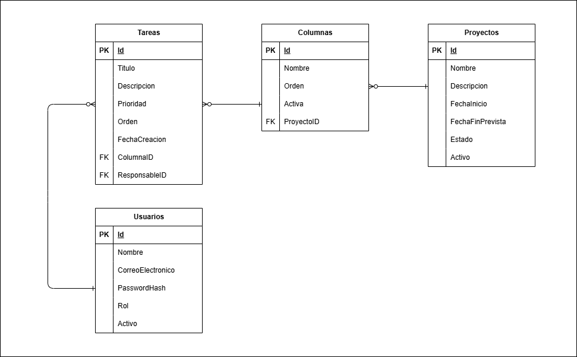
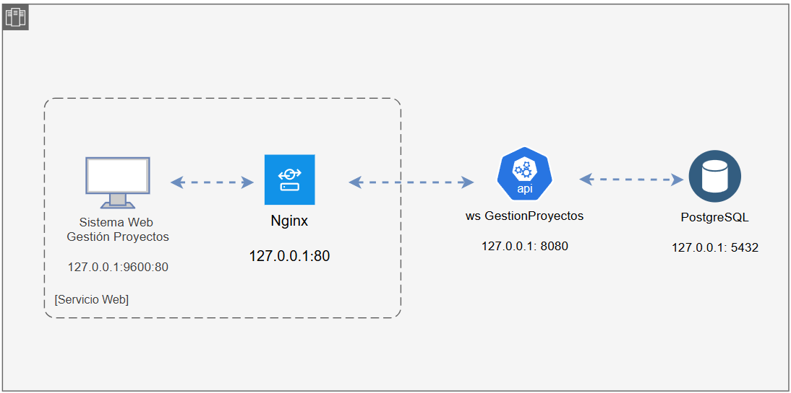

# Gestión de Proyectos Ágiles (Scrum/Kanban)

Plataforma full stack para la **gestión ágil de proyectos y equipos** con tablero **Kanban** en tiempo real. Permite organizar proyectos, definir flujos de trabajo mediante columnas, gestionar tareas con prioridades y responsables, y colaborar de forma **síncrona y multicliente** gracias a la comunicación bidireccional basada en **SignalR**.

| Capa | Tecnología |
|---|---|
| Frontend | Angular 17, TypeScript, PrimeNG/Sakai, RxJS |
| Backend | ASP.NET Core Web API 8, C# |
| Base de datos | PostgreSQL 17 |
| ORM | Entity Framework Core + Npgsql |
| Tiempo real | SignalR (WebSockets) |
| Autenticación | JWT (HMAC-SHA256) + BCrypt (salt/pepper) |
| Contenedores | Docker Compose, Nginx (reverse proxy), multi-stage builds |
| Tests | xUnit + Moq (back) · Jasmine/Karma (front) |

---

## Tabla de contenidos

1. [Funcionalidades principales](#funcionalidades-principales)
2. [Arquitectura del proyecto](#arquitectura-del-proyecto)
3. [Estructura de los proyectos](#estructura-de-los-proyectos)
4. [Comunicación en tiempo real (SignalR)](#comunicación-en-tiempo-real-signalr)
5. [Estrategia de ordenamiento en el backend](#estrategia-de-ordenamiento-en-el-backend)
6. [Puesta en marcha (Docker Compose)](#puesta-en-marcha-docker-compose)
7. [Credenciales de acceso](#credenciales-de-acceso)
8. [Variables de entorno](#variables-de-entorno)
9. [Testing](#testing)
10. [Documentación técnica](#documentación-técnica)
11. [Sobre el uso de herramientas de Inteligencia Artificial](#sobre-el-uso-de-herramientas-de-inteligencia-artificial)

---

## Funcionalidades principales

### Autenticación y seguridad
- **Login y registro** de usuarios con **JWT Bearer** (8 h de validez).
- Contraseñas protegidas con **BCrypt + salt pepper a nivel de aplicación**.
- **Guard de rutas** en el front que protege las vistas sin sesión válida.
- **Interceptor HTTP** que inyecta el token automáticamente y cierra sesión ante un `401`.
- Roles: **Administrador** y **Miembro**. El Admin puede eliminar recursos.

### Gestión de proyectos
- **CRUD de proyectos** (crear, editar, listar, eliminar lógico).
- **Paginación en backend** y **filtro por nombre**.
- Estados: Activo, Pausado, Finalizado.

### Tablero Kanban
- **CRUD de columnas** que definen el flujo de trabajo (p. ej. Por Hacer / En Progreso / Hecho).
- **CRUD de tareas** con título, descripción, **prioridad** (Baja/Media/Alta/Crítica) y **responsable**.
- **Drag & drop**: mover tareas entre columnas y **reordenar columnas** (posicionamiento relativo).
- **Filtros** por responsable, prioridad y búsqueda por texto.
- **Actualización optimista** de la UI con **reversión automática** en caso de error.

### Tiempo real (colaborativo)
- **Notificación instantánea** a los demás usuarios conectados al mismo tablero cuando una tarea/columna se crea, actualiza, mueve o elimina.
- **Presencia**: indicador de **usuarios conectados** al tablero.
- **Reintento automático** de conexión (`withAutomaticReconnect`).

---

## Arquitectura del proyecto

El repositorio se compone de **dos aplicaciones independientes** y una **base de datos** orquestadas con `docker-compose`:

```
gestion_proyectos/
├── gestion_proyectos_api/   → Backend (ASP.NET Core, solución multi-proyecto)
├── gestion_proyectos_web/   → Frontend (Angular SPA)
├── docs/                    → Diagramas (arquitectura, modelo de BD)
├── docker-compose.yml       → Orquestación principal
├── docker-compose.override.yml → Configuración de desarrollo local
└── .env.example             → Plantilla de variables de entorno
```

---

## Estructura de los proyectos

### Backend — `gestion_proyectos_api`

El backend es una **solución .NET con varios proyectos** (arquitectura limpia/hexagonal). Cada proyecto representa **una capa** con dependencias internas estrictamente controladas (regla de dependencia: hacia adentro).

```
gestion_proyectos_api/
├── gestion_proyectos_api/        → Capa de presentación (Web API)
│   ├── Controllers/           → Endpoints REST (Auth, Proyecto, Columnas, Tareas, Usuarios)
│   ├── Middleware/            → Manejador global de excepciones
│   ├── Program.cs             → Configuración de la aplicación, CORS, migraciones automáticas, mapeo del Hub
│   └── ConfiguracionServicio.cs  → Swagger con soporte JWT
│
├── Application/                  → Capa de aplicación / casos de uso
│   ├── CasosDeUso/            → Orquestación de la lógica (ProyectoUC, ColumnaUC, TareaUC, UsuarioUC, AuthUC)
│   ├── DTOs/                  → Contratos de entrada/salida (request/response)
│   ├── Interfaces/            → Contratos de servicios de infraestructura (IServicioAuth, IServicioTablero)
│   ├── Excepciones/           → Excepciones de dominio (Negocio, NoEncontrado)
│   └── Comun/                 → Tipos transversales (RespuestaPaginada, ApiSettings)
│
├── Domain/                       → Capa más interna (entidades) + contratos
│   ├── Entidades/              → Proyecto, Columna, Tarea, Usuario
│   ├── Enums/                  → Prioridad, EstadoProyecto, RolUsuario
│   └── Puertos/                → Interfaces de repositorio (IProyecto, IColumna, ITarea, IUsuario)
│
├── Infrastructure/               → Adaptadores (implementaciones concretas)
│   ├── Persistencia/            → AppDbContext, Configuraciones (map/schema + índices), Repositorios (EF)
│   ├── Migrations/              → Migraciones de EF Core
│   ├── ComunicacionContinua/    → TableroHub (SignalR) + ServicioTablero (emisión de eventos)
│   ├── Auth/                    → ServicioAuth (JWT + BCrypt)
│   └── ConfiguracionServicio.cs → Registro de dependencias (repositorios, casos de uso, JWT, SignalR)
│
└── Tests/                        → Pruebas unitarias (xunit + Moq)
```

### Frontend: `gestion_proyectos_web`

El frontend es una **SPA Angular 17** organizada por **módulos funcionales (feature-first)** con **componentes `standalone`**:

```
gestion_proyectos_web/
├── src/
│   ├── environments/          → Configuración de entorno (apiUrl, hubUrl)
│   └── app/
│       ├── core/               → Lógica compartida y transversal
│       │   ├── auth/           → Componente de Login
│       │   ├── guards/          → Guard de ruta (auth)
│       │   ├── interceptors/    → Interceptor HTTP JWT
│       │   ├── models/          → Modelos/tipos (DTO) reutilizables
│       │   └── services/        → Consumo de API REST y SignalR
│       ├── features/            → Módulos de dominio (uno por funcionalidad)
│       │   ├── proyectos/       → Lista y CRUD de proyectos
│       │   ├── tablero/         → Tablero Kanban (drag&drop + tiempo real)
│       │   └── usuarios/        → Administración de usuarios
│       ├── layout/              → Shell de la aplicación (menú, topbar, footer)
│       └── app.*.ts             → Configuración de rutas y providers
├── nginx.conf                   → Reverse proxy SPA + WebSocket
└── Dockerfile                   → Build multi-stage (Node → Nginx)
```

---

## Justificación de la arquitectura

### Backend: Arquitectura Hexagonal (Puertos y Adaptadores)

El backend sigue el patrón **Ports & Adapters (Arquitectura Hexagonal)**, también conocida como arquitectura limpia, dividida en **capas concéntricas**:

- **Domain** (núcleo): contiene las **entidades** de negocio y los **puertos** (interfaces). No conoce nada externo: no depende de EF, HTTP, ni de inyección.
- **Application** (casos de uso): expresa el **qué** hace el sistema, orquestando reglas de negocio contra los **puertos**.
- **Infrastructure** (adaptadores): implementa los **puertos** (repositorios EF, autenticación, SignalR, etc.) y se conecta hacia afuera (BD, tiempo real).
- **WebApi** (presentación): expone los casos de uso vía **Controller/HTTP**.

Beneficios concretos en este proyecto:

- **Inversión de dependencias**: `Domain` y `Application` no referencian EF Core ni ASP.NET. La capa web depende de los casos de uso; los casos de uso dependen de **interfaces** (`I*Repositorio`), nunca de la implementación. Cambiar PostgreSQL por otra BD solo toca `Infrastructure`.
- **Testabilidad**: al depender de interfaces, los casos de uso se prueban con **mocks** (véase `Tests/`) sin base de datos (p. ej. `ColumnaReglaNegocioTests` valida la regla *no eliminar columnas con tareas* con Moq).
- **Mantenibilidad y aislamiento**: los detalles de infraestructura (reconexión de SignalR, JWT, EF) no contaminan la lógica de negocio.
- **Separación neta de responsabilidades**: entidades, casos de uso, contratos y conexión se ubican en proyectos separados, lo que mejora la trazabilidad y la construcción incremental (ver `Dockerfile` multi-proyecto).

### Frontend: arquitectura por capas y por características

En el front se combina una **arquitectura en capas** (`core`, `features`, `layout`) con una **organización por features**. No es ni MVC clásico (la vista se renderiza en el servidor) ni un simple flujo de archivos colgados de `AppComponent`: se fundamenta en el **component-driven con preocupaciones separadas**, aprovechando el modelo de **componentes `standalone`** de Angular.

- **Core** concentra la utilidad transversal y de “plumbing” (autenticación, guard, interceptor, DTOs, servicios de API y SignalR), evitando duplicidades entre features.
- **Features** agrupa por dominio funcional (proyectos, tablero, usuarios) para que cada módulo sea independiente, favoreciendo la **lazy-loading** y la claridad.
- **Layout** aísla el *shell* visual, desacoplando estructura de negocio.

Beneficios:
- **Alta testabilidad**: los *services* y *utils* puros se prueban con claridad (existe `tablero-filtros.spec.ts`, `lista-proyectos.spec.ts`).
- **Reutilización y consistencia**: los servicios y modelos del `core` se comparten sin costo.
- **Escalabilidad funcional**: añadir una nueva capacidad es crear/ampliar un `feature`.
- **SEPARACIÓN de responsabilidades** entre lo visual (features/layout) y lo técnico (core), mejorando mantenibilidad en un equipo grande.

---

## Justificación de la arquitectura adicional

### Orquestación con Docker Compose y Nginx

Se eligió **`docker-compose`** porque levanta los tres servicios (API, Web y PostgreSQL) en una sola instrucción, con red interna, orden de arranque (`depends_on` + healthcheck de la BD) y variables desde un `.env`. La compilación usa **multi-stage builds** (Node 20 → Nginx; SDK .NET → runtime aspnet) para producir imágenes reducidas y seguras, mientras **Nginx** actúa de **reverse proxy**: sirve la SPA, reenvía `/api/*` al backend y habilita el upgrade de WebSocket para `/hub/*`.

---

## Justificación de la elección de SignalR (comunicación bidireccional)

El tablero requiere que múltiples clientes reciban **al instante** los cambios realizados por otros usuarios. Para esto se evaluaron 4 alternativas:

| Mecanismo | Sentido | Idoneidad aquí |
|---|---|---|
| **SignalR** ✓ | Bidireccional por WebSocket (con *fallback* y protocolos) | **Elegido** |
| WebSocket (puro) | Bidireccional | Muy cercano al protocolo; sin abstracción de grupos ni reconexión (reinventar la rueda). |
| Server-Sent Events (SSE) | Unidireccional (servidor → cliente) | No envía mensajes cliente → servidor; no sirve al patrón *groups* ni *presencia* interactiva. |
| Polling / Long-polling | Request-response / unidireccional | Alta latencia y sobrecarga innecesaria para tiempo real. |

**Razones para elegir SignalR:**

1. **Bidireccionalidad real por diseño**: la colaboración del tablero implica que un usuario dispara cambios (*mover tarea*, *crear columna*) y los demás deben enterarse en el mismo canal. SignalR gestiona el cruce cliente ⇄ servidor con WebSocket de forma transparente.

2. **Grupos (`Groups`)**: el Hub agrupa conexiones por proyecto (`tablero-{proyectoId}`). Así solo se notifica a los suscritos a un tablero concreto, sin broadcast global. `Clients.Group(...)` permite **difusión selectiva** muy sencilla.

3. **Abstracción de transporte y *fallback***: funciona por WebSocket cuando está disponible y **degrada a Server-Sent Events o Long Polling** de forma automática. Esto evita reinvertir en lógica de *fallback* si el proxy/red no soporta WebSocket.

4. **Reconexión automática y gestión de conexión**: con `withAutomaticReconnect()` el cliente de la librería SignalR de .NET se reconecta solo si se pierde la conexión, y el servidor limpia conexiones huérfanas en `OnDisconnectedAsync`.

5. **Protocolo de mensajería**: serialización JSON/MessagePack optimizada, manejo de *streaming*, y un modelo de eventos de alto nivel (`SendAsync` / `IHubContext`) que mantiene el código declarativo y mantenible al servicio.

6. **CORS y autenticación integrados**: el token JWT se envía por *query string* para el Hub (configurado en `OnMessageReceived`) y el CORS se habilita con `AllowCredentials`, cubriendo tanto las peticiones HTTP REST como el handshake de WebSocket, incluso desde un origen distinto.

7. **Adopción nativa en el ecosistema .NET**: al estar el backend en ASP.NET Core, SignalR es la solución *first-class* del framework; no añade dependencias externas y comparte tipado y DI del propio ecosistema.

---

## Estrategia de ordenamiento en el backend (índices de orden)

El tablero permite **reordenar de forma arbitraria** tanto las columnas como las tareas. Se usa el patrón conocido como **índice de segmentos / fractional indexing con `double`**, un mecanismo idóneo para **no reescribir todos los registros en cada movimiento**.

### Orden de tareas (fractional / gap)

En `TareaUC` (campo `Orden: double`) se mantiene un **gap inicial de 1000** y se calcula la posición según el lugar de inserción:

```
GAP_INICIAL = 1000.0   GAP_MINIMO = 1.0
```

- **Lista vacía** → `Orden = GAP_INICIAL (1000)`.
- **Insertar al inicio** → `Orden = primerElemento / 2`.
- **Insertar al final** → `Orden = últimoElemento + GAP_INICIAL`.
- **Insertar en medio** → `Orden = (anterior + siguiente) / 2` (promedio entre vecinos).

Este enfoque permite insertar/mover entre dos vecinos con un **único UPDATE** (solo cambia la fila movida). Tras muchas inserciones, la distancia entre vecinos **se reduce y puede llegar a colisionar**; por eso, el caso de uso detecta cuando el gap es menor a `GAP_MINIMO` y **renumera toda la columna** con `(i+1) * GAP_INICIAL`, restableciendo un amplio espacio sin perder el orden relativo.

Esto queda documentado y cubierto por pruebas unitarias en `Tests/CalcularPosicionTests.cs`: insertar al inicio da `1000/2 = 500`, al final `3000+1000 = 4000`, y en el medio `(1000+2000)/2 = 1500`.

### Orden de columnas (índice secuencial)

En `Columna` el orden es un **entero secuencial** (`Orden`), asignado con `maxOrden + 1` al crear y **renumerado a 0,1,2,...** en `ColumnaUC.Reordenar` cuando el usuario arrastra las columnas.

Esta opción es más sencilla que el fractional index: al haber pocas columnas por proyecto (decenas), renumerar todo el tablero (UPDATE de un puñado de filas) es barato, y es más intuitivo mantener un índice entero consecutivo para la primera dimensión (eje X). El dataset es pequeño, por lo que el costo de renumeración es despreciable en comparación con el esfuerzo de mantener decimales.

### Índices de base de datos

La persistencia es EF Core con **índices** dentro de las `Configuraciones`:

- **Índice único** en `usuarios.CorreoElectronico` (`HasIndex().IsUnique()`) para garantizar a nivel de BD que no existan correos duplicados y acelerar el login.
- Las FK y las relaciones se declaran en el contexto (cascada para columnas→tareas, `SetNull` para responsable, ...) siguiendo buenas prácticas.

El resto de las consultas frecuentes (listado del tablero por `ProyectoId` activo y ordenado) quedan soportadas por índices derivados de las propiedades clave y de las FK que EF genera por defecto (PK y los índices de las columnas foráneas), mientras el orden se aplica eficientemente en memoria sobre resultados ya acotados (tareas dentro de una columna, columnas de un proyecto).

---

## Puesta en marcha (Docker Compose)

> **Requisito**: tener **Docker** y **Docker Compose** instalados. No es necesario tener .NET, Node ni PostgreSQL locales, todo corre en contenedores.

Desde la **carpeta raíz** del repositorio (`gestion_proyectos`):

### 1. Configurar variables de entorno

Copia el archivo de ejemplo y edítalo si es necesario (los valores por defecto del ejemplo funcionan sin cambios):

```bash
# Linux / macOS / Git Bash
cp .env.example .env

# Windows (PowerShell)
Copy-Item .env.example .env
```

### 2. Levantar toda la plataforma

```bash
docker-compose up --build
```

Con `--build` las imágenes se compilan la primera vez (descarga de dependencias .NET/Npm). En siguientes arranques basta:

```bash
docker-compose up
```

### 3. Servidores

| Servicio | URL |
|---|---|
| Frontend Angular | [`http://localhost:9600`](http://localhost:9600) |
| API / Swagger | [`http://localhost:9500/swagger`](http://localhost:9500/swagger) |
| PostgreSQL | `localhost:5432` |
| Hub SignalR | `http://localhost:9500/hub/tablero` |

### 4. Detener los contenedores

```bash
docker-compose down
```

Para eliminar también los volúmenes (los datos de la BD):

```bash
docker-compose down -v
```

> Nota: el backend aplica **migraciones y data seed automáticamente** al arrancar (`db.Database.Migrate()`), por lo que la primera vez se crean las tablas y los usuarios por defecto.

---

## Credenciales de acceso

En la primera ejecución se crean dos usuarios de prueba (ver el *data seed* en `AppDbContext.OnModelCreating`):

| Correo | Contraseña | Rol |
|---|---|---|
| `admin@gestion.com` | `Admin123!` | Administrador |
| `miembro@gestion.com` | `Miembro123!` | Miembro |

---


## Variables de entorno

El archivo `.env` (carpeta raíz) alimenta a Compose. Definido en `.env.example`:

| Variable | Descripción | Valor de ejemplo |
|---|---|---|
| `POSTGRES_USER` | Usuario de PostgreSQL | `postgres` |
| `POSTGRES_PASSWORD` | Contraseña de PostgreSQL | `postgres` |
| `POSTGRES_DB` | Nombre de la base de datos | `gestion_proyectos` |
| `CONNECTION_STRING` | Cadena de conexión que usa el backend | `Server=postgresdb;Port=5432;Database=gestion_proyectos;...` |
| `SALT_GENERADOR_HASH` | Salt ("pepper") de la aplicación para el hash de contraseñas | valor secreto |
| `JWT_KEY` | Clave simétrica para firmar tokens JWT | valor secreto |
| `JWT_ISSUER` | `iss` del token | `GestionProyectosAPI` |
| `JWT_AUDIENCE` | `aud` del token | `GestionProyectosWeb` |

> **Seguridad**: no comprometas `.env` (está en `.gitignore`). En producción usa claves JWT y salt de alta entropía.

---

## Testing

### Backend (xUnit + Moq)

Pruebas unitarias sobre casos de uso (no requieren BD):

```bash
docker-compose exec webapi dotnet test Tests/Tests.csproj
```

O desde la carpeta de backend con .NET SDK local. Cobertura de estos módulos:
- Cálculo de nueva posición al reordenar tareas (`CalcularPosicionTests`).
- Reglas de negocio al eliminar una columna con/sin tareas (`ColumnaReglaNegocioTests`).
- Paginación del listado de proyectos (`PaginacionProyectosTests`).

### Frontend (Jasmine/Karma)

```bash
cd gestion_proyectos_web
npm install
npm test
```

---

## Documentación técnica

En la carpeta `docs/` se incluyen:

- `DiagramaModeloBaseDatos.png` — Modelado de base de dato (proyectos, columnas, tareas, usuarios).



- `DiagramaArquitecturaSoftware.png` — Vista de la arquitectura general (cliente, API, BD, SignalR).



---

## Sobre el uso de herramientas de Inteligencia Artificial

Durante el desarrollo de este proyecto se utilizaron **asistentes de IA** (editores y herramientas de codificación asistida) como **aceleradores del trabajo**, siempre bajo revisión. La colaboración de la IA se enfocó en:

- **Codificación parcial del frontend**: generación de componentes Angular (Drag & drop tablero), estilos PrimeNG, el servicio de tiempo real con SignalR.
- **Pruebas**: creación de casos de prueba unitarios (xUnit/Moq en el back y Jasmine/Karma en el front) validando los algoritmos clave (cálculo de posición, reglas de negocio, paginación).
- **Documentación**: redacción y organización de este README, comentarios de código.

La decisión de apoyarse en estas herramientas respondió a la necesidad de **agilizar el ciclo de desarrollo**, reducir la latencia de escritura de código y estandarizar buenas prácticas de forma más rápida. La IA bien usada mejora la productividad mientras el criterio profesional humano garantiza la calidad, seguridad y correctitud del entregable.